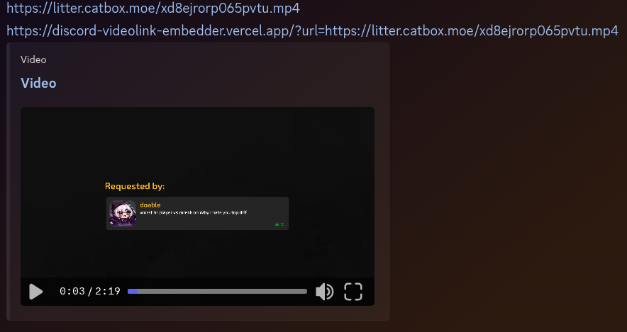

# About
Play non-embedding video file links directly in Discord by generating a web page with the [video as metadata](https://ogp.me/), which Discord automatically embeds.

# Usage
Append `?url=<URL>` to the end of `https://discord-videolink-embedder.vercel.app/`, where `<URL>` is replaced with a direct link to the video file of the video you want to embed. The new link as a whole, when shared to Discord, will turn into an embed with an attached video file.

For example, to embed `https://video.com/video.mp4` to be viewable directly on Discord, send the link `https://discord-videolink-embedder.vercel.app/?url=https://video.com/video.mp4` as a message.

# Example
